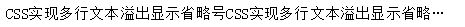
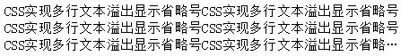

# CSS控制文本，超出显示省略号
### 1. 单行文本溢出显示省略号
**实现方法：**

<pre><code>overflow: hidden;
text-overflow:ellipsis;
white-space: nowrap;
</code></pre>

**效果图：**

### 2. 多行文本溢出显示省略号
**实现方法**

<pre><code>display: -webkit-box;
-webkit-box-orient: vertical;
-webkit-line-clamp: 3;
overflow: hidden;
</code></pre>
**效果图：**

